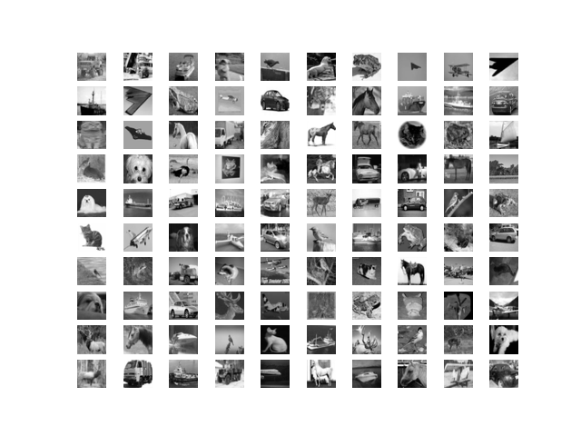
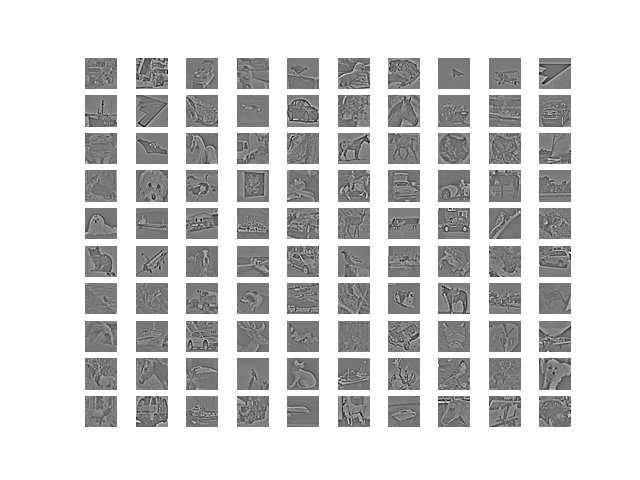

# PyTorch Whitening Normalization Layer

This module implements ZCA whitening normalization layer for PyTorch.

You can run `whitening.py` directly which demonstrates a simple example on the CIFAR-10 dataset. Alternatively you can import the file into your project.

## Example Usage

```python
import torch
from whitening import WhiteningNormalization

data = torch.rand(1000, 10)
whitening = WhiteningNormalization(10, eps=0.1)
# Set to training mode, so we compute the ZCA matrix.
whitening.train()
whitened_data = whitening(data)
```

## Whitening Transformation

Whitening is a transformation that removes the correlation between features, ensuring that the features are uncorrelated and have unit variance. The process involves the following steps:

1. **Computing the Covariance Matrix**: Calculate the covariance matrix of the centered data:

   $$\mathbf{\Sigma} = \frac{1}{m} \left(\mathbf{X} - \mathbf{\mu}\right)^\top \left(\mathbf{X} - \mathbf{\mu}\right)$$

   where $m$ is the number of samples.

2. **Eigenvalue Decomposition**: Perform eigenvalue decomposition on the covariance matrix $\mathbf{\Sigma} = \mathbf{P} \mathbf{D} \mathbf{P}^\top$ where $\mathbf{P}$ is the matrix of eigenvectors and $\mathbf{D}$ is the diagonal matrix of eigenvalues.

3. **Computing the Whitening Matrix**: Calculate the whitening matrix $$\mathbf{W}_{\text{zca}} = \mathbf{P} \left(\mathbf{D}^{-\frac{1}{2}} + \varepsilon \mathbf{I} \right) \mathbf{P}^\top.$$ Here $\varepsilon$ is a regularization parameter to ensure that the smallest eigenvalues don't impact the result.

4. **Applying the Whitening Transformation**: Multiply the centered data by the whitening matrix $\mathbf{X}_{\text{zca}} = \left(\mathbf{X} - \mathbf{\mu}\right) \mathbf{W}_{\text{zca}}$.

### Properties of ZCA Whitening

* **Identity Covariance**: The covariance matrix of the whitened data is the identity matrix, i.e. $\text{Cov}(\mathbf{X}_{\text{zca}}) = \mathbf{I}$.

* **Minimal Distortion**: Among all whitening transformations, ZCA whitening minimizes the squared error between the original centered data and the whitened data.

### Example

#### Original prewhitened images



#### ZCA whitened images


